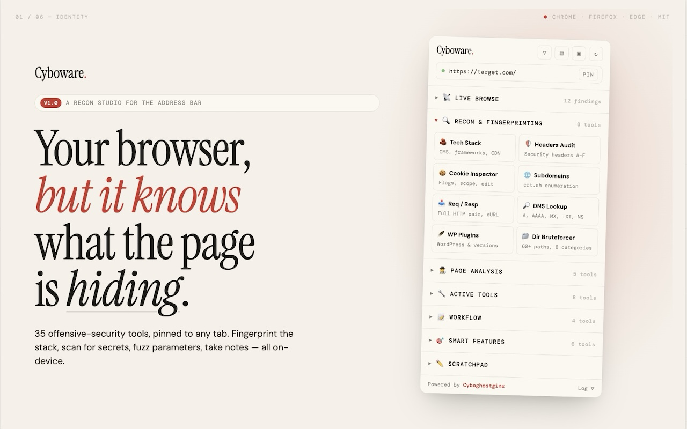
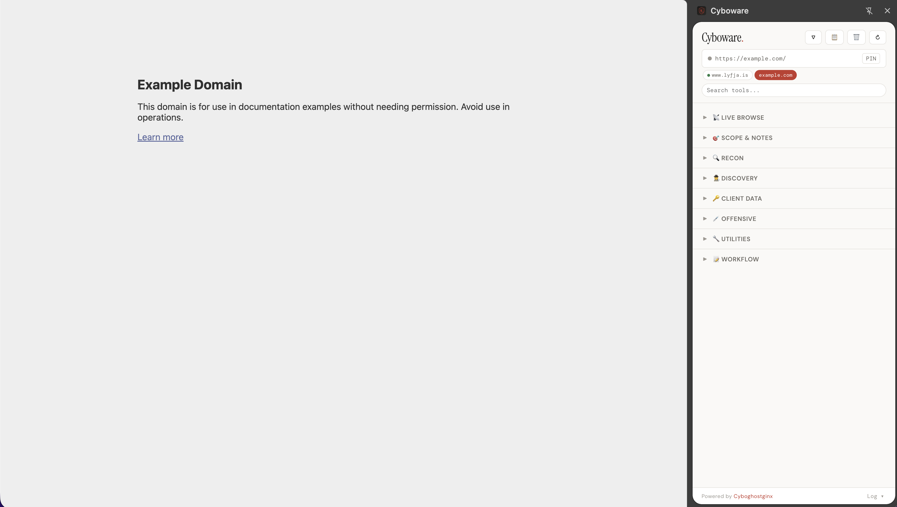

# Cyboware.

**Bug bounty toolkit in your browser sidebar. 35 tools. Zero dependencies. Zero data collection.**

A Chrome extension built for bug bounty hunters, pentesters, and security researchers. Everything runs locally in your browser — no accounts, no API keys, no telemetry.

**_Free & Open Source. Feel free to contribute and report bugs or improvements._**

---

## Install

**Chrome Web Store:** [Coming soon] (Verification, review and all)

**Manual:**
1. Download or clone this repo
2. Go to `chrome://extensions/` → enable Developer mode
3. Click **Load unpacked** → select the folder (Unzipped)
4. Click the Cyboware icon — sidebar opens

When new version drops, and you want to install manually, you have to remove the existing one at `chrome://extensions/` then re install with instuction above with the new downloaded unpacked.

_last updated: Apr 29, 2026 | 15:30 (Just so if you are running the extension manually, you can know if you are running the updated version or not 😉)_

**Sometimes you need to refresh your page in case some of the tools is not detecting anything.**

---

## Tools (35)

### Recon & Fingerprinting
| Tool | What it does |
|---|---|
| Tech Stack | Detects CMS, frameworks, CDNs, libraries |
| Headers Audit | Grades 8 security headers A–F |
| Cookie Inspector | Per-cookie copy, copy as header, export JSON |
| Subdomains | crt.sh + HackerTarget fallback |
| Req / Resp | Full HTTP pair with cookies, editable request builder, copy as cURL |
| DNS Lookup | A, AAAA, MX, TXT, NS, CNAME via Google DoH |
| WP Plugins | WordPress plugins, themes, version detection |
| Dir Bruteforcer | 60+ paths across 8 categories, parallel scanning |

### Page Analysis
| Tool | What it does |
|---|---|
| Secret Scanner | 17 patterns — AWS, GitHub, Stripe, Slack, JWT, Firebase, private keys |
| Endpoints | API paths, REST, GraphQL, WebSocket URLs from all JS |
| Hidden Elements | Hidden inputs, disabled fields, data-attributes, HTML comments + reveal |
| Link Harvester | Internal, external, interesting files, emails |
| JS Beautifier | Deobfuscate and format any loaded JS file |

### Active Tools
| Tool | What it does |
|---|---|
| Request Replayer | Capture XHR, edit, replay, copy as cURL |
| CORS Tester | Origin reflection + credentials check |
| Redirect Tester | Detects 13 common redirect params |
| Encode / Decode | Base64, URL, HTML, hex, JWT, ROT13, Unicode |
| Parameter Fuzzer | XSS/SQLi/SSTI/Path Traversal with false-positive detection |
| 403 Bypass | 17 header + path bypass techniques |
| Method Tester | GET/POST/PUT/DELETE/PATCH/OPTIONS/HEAD/TRACE with body diff |
| JWT Editor | Decode, edit payload, re-encode with `alg:none` |

### Workflow
| Tool | What it does |
|---|---|
| Scope Manager | In/out scope domains with visual indicator |
| Bug Notes | Per-domain notes, export as .txt |
| Browse History | Auto-recorded URLs per domain |
| Screenshot | Capture + download as PNG |

### Smart Features
| Tool | What it does |
|---|---|
| Vuln Hints | Passive detection — reflected params, JSONP, postMessage |
| Wayback | Historical snapshots via archive.org |
| Response Diff | Compare responses with different cookies/headers |
| CSP Evaluator | Grades CSP, flags bypasses (unsafe-inline, CDN bypasses, wildcards) |
| Subdomain Takeover | Dangling CNAME detection against 16 service fingerprints |
| IDOR Detector | Finds numeric/UUID params in URL + XHR, suggests ±1 tests |

### Live Browse
Real-time passive scanner. Monitors every page load for secrets, endpoints, vulns, forms, cookies, params, headers, and source maps. Deduplicates findings. Per-domain isolation. Exportable.

---

## UX

- **PIN mode** — lock sidebar to one tab while browsing others
- **Domain pills** — switch between targets without losing results (subdomains isolated)
- **Auto-restore** — switch away and back, your results are still there
- **Copy All Report** — one-click formatted report of all findings
- **Collapse all** — toggle all sections open/closed
- **Scratchpad** — persistent notepad for payloads and URLs
- **Debug log** — expandable error log in footer

---

## Privacy

Everything runs locally. No data leaves your browser except when you explicitly trigger subdomain enumeration (crt.sh), DNS lookup (dns.google), or Wayback (archive.org). No analytics. No telemetry. [Full privacy policy](PRIVACY.md).

---

## License

MIT
